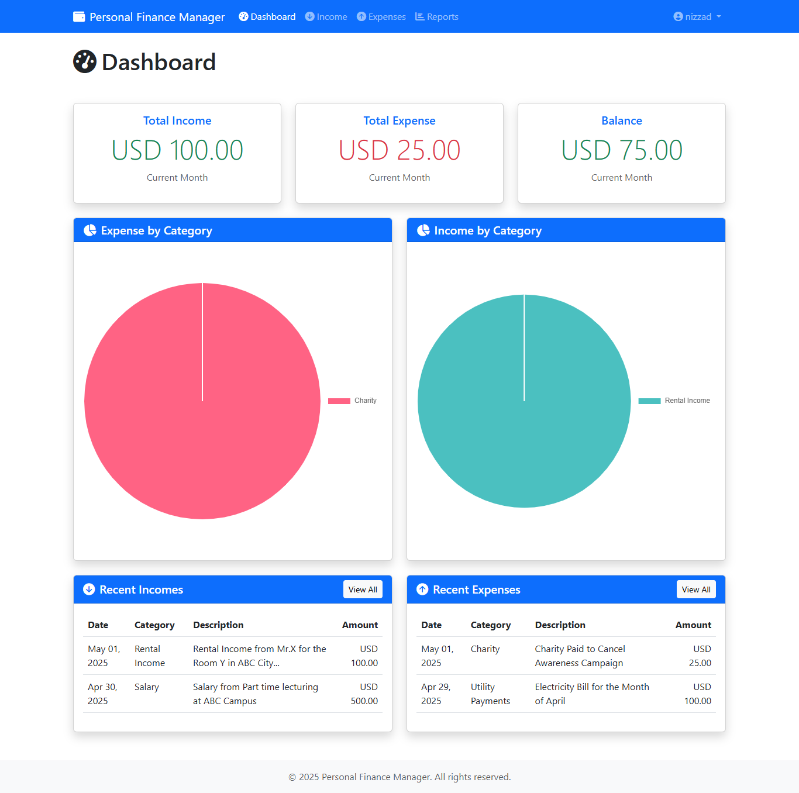

# Personal Finance Manager (PFM) - A Comprehensive Solution for Managing Personal Finances

## Personal Finance Manager (PFM) Demo
[https://github.com/user-attachments/assets/3db5de5b-afc4-4901-bc8a-6e9e861a7772](https://github.com/user-attachments/assets/1af55c72-f618-4900-8ca5-fef017f9f5b6)

## The entire Application is developed using [AWS Q Developer](https://aws.amazon.com/q/developer/build/), the leading AI Powered Code Assistant

The Personal Finance Manager (PFM) is a robust web application that enables users to track, manage, and analyze their personal income and expenses efficiently. Built with PHP and MySQL, this application provides a secure, user-specific environment where individuals can maintain detailed records of their financial transactions and generate comprehensive reports.

The application features an intuitive dashboard with real-time financial insights, customizable income and expense categories, and detailed reporting capabilities. Users can track transactions in their preferred currency, analyze spending patterns through visual charts, and export financial data for further analysis. With both light and dark mode support, PFM offers a modern, responsive interface that adapts to user preferences.

## Repository Structure
```
.
├── config/                  # Configuration files for database and application settings
├── controllers/            # Application logic and request handling
│   ├── AuthController.php      # Handles user authentication and authorization
│   ├── DashboardController.php # Manages dashboard view and data
│   ├── ExpenseController.php   # Handles expense-related operations
│   ├── IncomeController.php    # Manages income-related operations
│   └── ReportController.php    # Generates financial reports and exports
├── models/                 # Data models and database interactions
│   ├── Expense.php            # Expense data operations
│   ├── Income.php            # Income data operations
│   └── User.php              # User management operations
└── views/                  # User interface templates
    ├── auth/                  # Authentication-related views
    ├── dashboard/            # Dashboard interface
    ├── expense/             # Expense management views
    ├── income/              # Income management views
    └── report/              # Report generation interface
```




## Usage Instructions
### Prerequisites
- PHP 7.4 or higher
- MySQL 5.7 or higher
- Web server (Apache/Nginx)
- Modern web browser with JavaScript enabled
- Composer (for dependency management)

### Installation

1. Clone the repository:
```bash
git clone https://github.com/mohamednizzad/personal-finance-manager.git
cd personal-finance-manager
```

2. Configure the database:
```bash
# Create a new MySQL database
mysql -u root -p
CREATE DATABASE pfm_db;
exit;

# Import the database schema
mysql -u root -p pfm_db < config/database.sql
```

3. Configure the application:
```bash
# Copy the sample configuration file
cp config/config.sample.php config/config.php

# Edit the configuration file with your database credentials
nano config/config.php
```

4. Set up the web server:
```apache
# Apache configuration (.htaccess)
RewriteEngine On
RewriteBase /
RewriteCond %{REQUEST_FILENAME} !-f
RewriteCond %{REQUEST_FILENAME} !-d
RewriteRule ^(.*)$ index.php?page=$1 [QSA,L]
```

### Quick Start
1. Navigate to the application URL in your web browser
2. Register a new account using your email address
3. Log in to access the dashboard
4. Set up your income and expense categories
5. Start tracking your transactions

### More Detailed Examples

1. Adding a new income:
```php
// Navigate to Income > Add New
// Fill in the following details:
Amount: 1000.00
Category: Salary
Date: 2023-07-01
Description: Monthly salary payment
```

2. Creating an expense category:
```php
// Navigate to Expenses > Categories > Add New
Name: Groceries
Description: Daily grocery expenses
```

### Troubleshooting

1. Database Connection Issues
```
Error: Could not connect to database
Solution: 
- Verify database credentials in config/config.php
- Ensure MySQL service is running
- Check database user permissions
```

2. Permission Issues
```
Error: Cannot write to log file
Solution:
- Set correct permissions: chmod 755 -R /path/to/application
- Ensure web server user has write permissions
```

## Data Flow
The application follows a structured MVC pattern for data processing and presentation.

```ascii
User Input → Controller → Model → Database
     ↑          ↓          ↑
     └──── View ←──────────┘
```

Key component interactions:
1. Controllers handle user requests and input validation
2. Models manage data persistence and business logic
3. Views render data and handle user interface
4. Authentication middleware ensures secure access
5. Database layer manages transaction consistency
