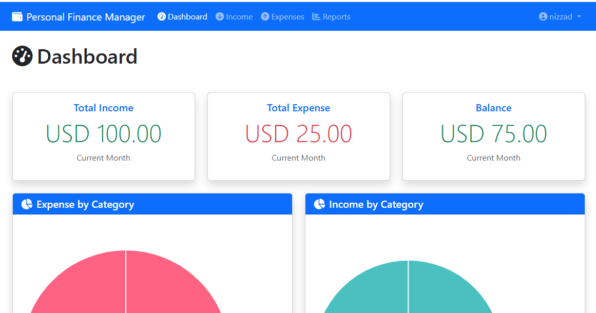

# Personal Finance Manager (PFM) - A Comprehensive Solution for Managing Personal Finances

## Personal Finance Manager (PFM) Demo
[https://github.com/user-attachments/assets/3db5de5b-afc4-4901-bc8a-6e9e861a7772](https://github.com/user-attachments/assets/1af55c72-f618-4900-8ca5-fef017f9f5b6)

## The entire Application is developed using [AWS Q Developer](https://aws.amazon.com/q/developer/build/), the leading AI Powered Code Assistant

The Personal Finance Manager (PFM) is a robust web application that enables users to track, manage, and analyze their personal income and expenses efficiently. Built with PHP and MySQL, this application provides a secure, user-specific environment where individuals can maintain detailed records of their financial transactions and generate comprehensive reports.

The application features an intuitive dashboard with real-time financial insights, customizable income and expense categories, and detailed reporting capabilities. Users can track transactions in their preferred currency, analyze spending patterns through visual charts, and export financial data for further analysis. With both light and dark mode support, PFM offers a modern, responsive interface that adapts to user preferences.

## Repository Structure
```
├── config/                  # Configuration files for database and application settings
├── controllers/            # Application logic and request handling
│   ├── AuthController.php      # Handles user authentication and authorization
│   ├── DashboardController.php # Manages dashboard view and data
│   ├── ExpenseController.php   # Handles expense-related operations
│   ├── IncomeController.php    # Manages income-related operations
│   └── ReportController.php    # Generates financial reports and exports
├── models/                 # Data models and database interactions
│   ├── Expense.php            # Expense data operations
│   ├── Income.php            # Income data operations
│   └── User.php              # User management operations
└── views/                  # User interface templates
    ├── auth/                  # Authentication-related views
    ├── dashboard/            # Dashboard interface
    ├── expense/             # Expense management views
    ├── income/              # Income management views
    └── report/              # Report generation interface
```

# Personal Finance Manager (PFM)


A user-friendly web application to help you track, manage, and analyze your personal finances with ease.

## 📋 Table of Contents
- [Features](#features)
- [Getting Started](#getting-started)
  - [Prerequisites](#prerequisites)
  - [Installation](#installation)
- [How to Use](#how-to-use)
  - [Creating an Account](#creating-an-account)
  - [Managing Income](#managing-income)
  - [Managing Expenses](#managing-expenses)
  - [Generating Reports](#generating-reports)
  - [Customizing Settings](#customizing-settings)
- [Screenshots](#screenshots)
- [Technologies Used](#technologies-used)
- [Troubleshooting](#troubleshooting)
- [Contributing](#contributing)

## ✨ Features

- **User Account Management**
  - Secure sign-up and login
  - Password reset functionality
  - Personalized user profiles
  - Currency preference setting

- **Income Tracking**
  - Add, view, edit, and delete income entries
  - Create custom income categories
  - Track income by date, amount, and category

- **Expense Management**
  - Record and categorize all expenses
  - Create custom expense categories
  - Detailed expense history

- **Comprehensive Reporting**
  - Filter transactions by date range, category, or type
  - Visual charts and summaries
  - Export reports to CSV format

- **User-Friendly Interface**
  - Responsive design for all devices
  - Light and dark mode options
  - Intuitive navigation

## 🚀 Getting Started

### Prerequisites

Before you begin, ensure you have the following installed:
- PHP 7.4 or higher
- MySQL 5.7 or higher
- Web server (Apache/Nginx)
- Modern web browser with JavaScript enabled

### Installation

Follow these simple steps to get your Personal Finance Manager up and running:

1. **Clone the repository**
   ```bash
   git clone https://github.com/yourusername/personal-finance-manager.git
   cd personal-finance-manager
   ```

2. **Set up the database**
   ```bash
   # Create a new MySQL database
   mysql -u root -p
   CREATE DATABASE pfm_db;
   exit;

   # Import the database schema
   mysql -u root -p pfm_db < config/database.sql
   ```

3. **Configure the application**
   - Copy the sample configuration file:
     ```bash
     cp config/config.sample.php config/config.php
     ```
   - Edit `config/config.php` with your database credentials:
     ```php
     define('DB_HOST', 'localhost');
     define('DB_USER', 'your_username');
     define('DB_PASS', 'your_password');
     define('DB_NAME', 'pfm_db');
     ```

4. **Set up the web server**
   - For Apache, ensure the `.htaccess` file contains:
     ```apache
     RewriteEngine On
     RewriteBase /
     RewriteCond %{REQUEST_FILENAME} !-f
     RewriteCond %{REQUEST_FILENAME} !-d
     RewriteRule ^(.*)$ index.php?page=$1 [QSA,L]
     ```
   - For Nginx, configure your server block accordingly

5. **Access the application**
   - Open your web browser and navigate to: `http://localhost/personal-finance-manager`
   - If using a virtual host, navigate to your configured domain

## 📱 How to Use

### Creating an Account

1. Click on the "Register" button on the homepage
2. Fill in your details (name, email, password)
3. Verify your email address (if enabled)
4. Log in with your new credentials
5. Set your preferred currency in the settings

### Managing Income

1. Navigate to "Income" in the main menu
2. Click "Add New Income" to record a new entry
3. Fill in the amount, date, category, and description
4. Click "Save" to store your income record
5. View all income entries in the income list
6. Edit or delete entries as needed

### Managing Expenses

1. Go to "Expenses" in the main menu
2. Click "Add New Expense" to record a new expense
3. Enter the amount, date, category, and description
4. Click "Save" to store your expense record
5. View all expenses in the expense list
6. Edit or delete entries as needed

### Generating Reports

1. Navigate to "Reports" in the main menu
2. Select your desired report type (income, expense, or both)
3. Choose a date range (daily, weekly, monthly, custom)
4. Select specific categories (optional)
5. Click "Generate Report" to view results
6. Use the "Export to CSV" button to download your report

### Customizing Settings

1. Click on your profile icon and select "Settings"
2. Update your profile information
3. Change your password
4. Set your preferred currency
5. Toggle between light and dark mode
6. Save your changes

## 📸 Screenshots

*[Note: Add actual screenshots of your application here]*

## 🛠️ Technologies Used

- **Backend**: PHP
- **Database**: MySQL
- **Frontend**: HTML, CSS, JavaScript
- **CSS Framework**: Bootstrap
- **Icons**: Font Awesome
- **Charts**: Chart.js

## Data Flow
The application follows a structured MVC pattern for data processing and presentation.

```ascii
User Input → Controller → Model → Database
     ↑          ↓          ↑
     └──── View ←──────────┘
```

## ❓ Troubleshooting

### Common Issues and Solutions

1. **Database Connection Error**
   - Verify your database credentials in `config/config.php`
   - Ensure MySQL service is running
   - Check that the database user has proper permissions

2. **Page Not Found Errors**
   - Verify that your web server rewrite rules are correctly configured
   - Check that all files have the correct permissions

3. **Login Issues**
   - Clear your browser cookies and cache
   - Reset your password if you've forgotten it
   - Ensure your email address was verified (if required)

4. **Display Problems**
   - Try switching between light and dark mode
   - Test with a different browser
   - Ensure JavaScript is enabled

## 🤝 Contributing

Contributions are welcome! If you'd like to improve the Personal Finance Manager:

1. Fork the repository
2. Create a new branch (`git checkout -b feature/amazing-feature`)
3. Make your changes
4. Commit your changes (`git commit -m 'Add some amazing feature'`)
5. Push to the branch (`git push origin feature/amazing-feature`)
6. Open a Pull Request

---

Created with ❤️ for better Personal Finance Manager using [AWS Q Developer](https://aws.amazon.com/q/developer/build/) for Amazon Q Developer Challenge on [Dev.to](https://dev.to/challenges/aws-amazon-q-v2025-04-30)
